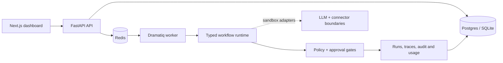

# OpsPilot v1.0.0

Deployed AI operations platform for running auditable, human-supervised business workflows.

[Production dashboard](https://opspilot-web-iota.vercel.app/) · [API health](https://api-production-35aff.up.railway.app/health) · [Evidence record](docs/evidence.md) · [Release checklist](docs/release-checklist.md)

OpsPilot is a production-shaped internal platform: events become typed workflow steps, permissioned
tools and human approval decisions. The public v1.0.0 release is deployed as a Next.js dashboard on
Vercel and a FastAPI API plus Dramatiq worker, PostgreSQL and Redis services on Railway.

OpsPilot connects events to typed workflow steps, permissioned tools and human approval. The
showcase is the **Inbound Revenue Agent**: a sales enquiry is extracted, enriched, scored, drafted
and paused before the outbound step. Sandbox connectors remain the default in the repository; the
deployed demo workspace also has a separately configured Gmail OAuth connection for the verified
live path.



The checked-in build is intentionally reproducible: it uses a deterministic local LLM provider and
sandbox connector adapters. It does not make OpenAI or Anthropic requests, and HubSpot, Calendar
and Slack remain sandbox boundaries. Gmail is an explicitly configured OAuth connector with
server-side encrypted refresh-token storage, read/search, draft creation and approval-gated send.
The deployed Gmail connection and provider-side send are recorded separately in
[`docs/evidence.md`](docs/evidence.md).

## Production release

The v1.0.0 deployment has this topology:

```text
Vercel
└── opspilot-web (Next.js)

Railway: opspilot
├── api (FastAPI)
├── worker (Dramatiq)
├── Postgres
└── Redis
```

The live verification exercised the complete Gmail lane: an authorized self-addressed test
message was found through the Gmail API, turned into a durable `gmail.email_received` run, paused
at `waiting_for_approval`, approved from the public dashboard, and sent through Gmail. The provider
returned a confirmed send response with `external: true` and `sandbox: false`. This does not claim
recipient delivery or a customer outcome.

The repository is public at [github.com/ANKOHR/opspilot](https://github.com/ANKOHR/opspilot), and
`main` is protected with required `backend` and `web` checks, one review, strict status checks and
linear history.

## What is included

- FastAPI API with organisation-scoped data access
- SQLAlchemy data model for organisations, members, integrations-ready workflows, runs, traces,
  approvals, audit logs and usage records
- deterministic structured-output provider plus OpenAI/Anthropic provider boundaries
- tool registry with read/write/external action classes
- optional Gmail OAuth connector with encrypted credentials, message sync, drafts and approval-gated send
- approval inbox and replayable runs
- idempotent event ingestion and bounded worker retries
- Next.js operations dashboard with Overview, Workflows, Runs, Approvals, Integrations, Analytics
  and Settings views
- three versioned showcase workflow definitions
- 100-case synthetic evaluation runner
- Docker Compose for Postgres, Redis, API, worker and web
- Alembic migration entry point for deployment schema bootstrap

## Verified release evidence

The release evidence record separates observed behaviour from staged capabilities. It currently
records:

- 60 backend tests passing locally
- 100 generated synthetic evaluation cases passing across intent, fit-band, approval-policy and schema-compliance metrics
- production RBAC, idempotency and checkpoint replay checks
- Railway health and service status
- Vercel HTTP 200 and API CORS verification
- live Gmail OAuth, targeted ingestion, approval-gated send and provider response

See [`docs/evidence.md`](docs/evidence.md) for the exact boundaries and reproducibility notes.

## Run locally

```powershell
cd C:\Users\henry\opspilot
.venv\Scripts\python.exe -m uvicorn opspilot_api.main:app --app-dir apps/api --reload
```

In another terminal:

```powershell
cd C:\Users\henry\opspilot\apps\web
pnpm install
pnpm dev
```

Open `http://localhost:3000`. The dashboard is usable with or without the API; when the API is
running, **Run showcase** and approval actions call the sandbox endpoints. To configure Gmail,
copy `.env.example`, create a Google OAuth Web application, set the callback URL, and use
**Connect Gmail** on the Integrations page. Refresh tokens are never sent to the browser.

Run backend tests and local evals:

```powershell
.venv\Scripts\python.exe -m pytest -q
.venv\Scripts\python.exe packages\evals\run_evals.py
```

Run the full local verification pass:

```powershell
.\scripts\verify.ps1
```

Apply the versioned schema before starting a deployment-shaped API:

```powershell
.venv\Scripts\python.exe -m opspilot_api.migrate
```

The architecture source is in
[`docs/architecture.mmd`](docs/architecture.mmd).
The external publication and deployment gates are tracked in
[`docs/release-checklist.md`](docs/release-checklist.md).
The Railway and Vercel runbook is in [`docs/deployment.md`](docs/deployment.md).

Run the production-shaped stack:

```powershell
docker compose up --build
```

## Truth boundary

No credentials are committed to the repository. The local default has no live outbound side effects,
and the measured evaluation is generated synthetic-fixture evidence. OpenAI and Anthropic are
provider boundaries, not claimed live integrations. Gmail OAuth and provider calls are configured
only in the separately deployed demo workspace and are backed by the evidence record. A successful
Gmail API response confirms provider acceptance of the request; it is not presented as proof of
recipient delivery.
