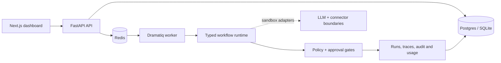

# OpsPilot

Production-shaped AI operations platform for running auditable, human-supervised business
workflows.

OpsPilot connects events to typed workflow steps, permissioned tools and human approval. The local
showcase is the **Inbound Revenue Agent**: a fictional sales enquiry is extracted, enriched,
scored, drafted and paused before the outbound step. Approving it continues the run in sandbox
mode and records the entire trace.



The default build is intentionally reproducible: it uses a deterministic local LLM provider and
sandbox connector adapters. It does not make OpenAI, Anthropic, Gmail, HubSpot, Calendar or Slack
requests. Provider and connector boundaries are present for later configuration, but live API
credentials, OAuth and external side effects are not part of the local claim.

## What is included

- FastAPI API with organisation-scoped data access
- SQLAlchemy data model for organisations, members, integrations-ready workflows, runs, traces,
  approvals, audit logs and usage records
- deterministic structured-output provider plus OpenAI/Anthropic provider boundaries
- tool registry with read/write/external action classes
- approval inbox and replayable runs
- idempotent event ingestion and bounded worker retries
- Next.js operations dashboard with Overview, Workflows, Runs, Approvals, Integrations, Analytics
  and Settings views
- three versioned showcase workflow definitions
- 100-case synthetic evaluation runner
- Docker Compose for Postgres, Redis, API, worker and web

## Run locally

```powershell
cd C:\Users\henry\opspilot
.venv\Scripts\python.exe -m uvicorn opspilot_api.main:app --app-dir apps/api --reload
```

In another terminal:

```powershell
cd C:\Users\henry\opspilot\apps\web
pnpm install
pnpm dev
```

Open `http://localhost:3000`. The dashboard is usable with or without the API; when the API is
running, **Run showcase** and approval actions call the sandbox endpoints.

Run backend tests and local evals:

```powershell
.venv\Scripts\python.exe -m pytest -q
.venv\Scripts\python.exe packages\evals\run_evals.py
```

Run the full local verification pass:

```powershell
.\scripts\verify.ps1
```

The verification record and the list of deliberately unclaimed capabilities are in
[`docs/evidence.md`](docs/evidence.md). The architecture source is in
[`docs/architecture.mmd`](docs/architecture.mmd).
The external publication and deployment gates are tracked in
[`docs/release-checklist.md`](docs/release-checklist.md).

Run the production-shaped stack:

```powershell
docker compose up --build
```

## Truth boundary

The default project has no live OAuth credentials and no real outbound side effects. The measured
evaluation is generated synthetic-fixture evidence. Connectors, OAuth, provider calls, deployment
and customer outcomes require separate configuration and verification.
