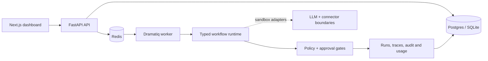

# OpsPilot

Production-shaped AI operations platform for running auditable, human-supervised business
workflows.

OpsPilot connects events to typed workflow steps, permissioned tools and human approval. The local
showcase is the **Inbound Revenue Agent**: a sales enquiry is extracted, enriched, scored, drafted
and paused before the outbound step. With no live connector configured, approval continues in
sandbox mode; with the optional Gmail OAuth connector configured, only the approved Gmail action
uses the connected account and the trace labels that external side effect explicitly.



The default build is intentionally reproducible: it uses a deterministic local LLM provider and
sandbox connector adapters. It does not make OpenAI, Anthropic, HubSpot, Calendar or Slack
requests. Gmail is an optional, explicitly configured OAuth connector with server-side encrypted
refresh-token storage, read/search, draft creation and approval-gated send. No live provider claim
is made unless the OAuth connection and provider-side result have been separately verified.

## What is included

- FastAPI API with organisation-scoped data access
- SQLAlchemy data model for organisations, members, integrations-ready workflows, runs, traces,
  approvals, audit logs and usage records
- deterministic structured-output provider plus OpenAI/Anthropic provider boundaries
- tool registry with read/write/external action classes
- optional Gmail OAuth connector with encrypted credentials, message sync, drafts and approval-gated send
- approval inbox and replayable runs
- idempotent event ingestion and bounded worker retries
- Next.js operations dashboard with Overview, Workflows, Runs, Approvals, Integrations, Analytics
  and Settings views
- three versioned showcase workflow definitions
- 100-case synthetic evaluation runner
- Docker Compose for Postgres, Redis, API, worker and web
- Alembic migration entry point for deployment schema bootstrap

## Run locally

```powershell
cd C:\Users\henry\opspilot
.venv\Scripts\python.exe -m uvicorn opspilot_api.main:app --app-dir apps/api --reload
```

In another terminal:

```powershell
cd C:\Users\henry\opspilot\apps\web
pnpm install
pnpm dev
```

Open `http://localhost:3000`. The dashboard is usable with or without the API; when the API is
running, **Run showcase** and approval actions call the sandbox endpoints. To configure Gmail,
copy `.env.example`, create a Google OAuth Web application, set the callback URL, and use
**Connect Gmail** on the Integrations page. Refresh tokens are never sent to the browser.

Run backend tests and local evals:

```powershell
.venv\Scripts\python.exe -m pytest -q
.venv\Scripts\python.exe packages\evals\run_evals.py
```

Run the full local verification pass:

```powershell
.\scripts\verify.ps1
```

Apply the versioned schema before starting a deployment-shaped API:

```powershell
.venv\Scripts\python.exe -m opspilot_api.migrate
```

The verification record and the list of deliberately unclaimed capabilities are in
[`docs/evidence.md`](docs/evidence.md). The architecture source is in
[`docs/architecture.mmd`](docs/architecture.mmd).
The external publication and deployment gates are tracked in
[`docs/release-checklist.md`](docs/release-checklist.md).
The Railway and Vercel runbook is in [`docs/deployment.md`](docs/deployment.md).

Run the production-shaped stack:

```powershell
docker compose up --build
```

## Truth boundary

The default project has no live OAuth credentials and no real outbound side effects. The measured
evaluation is generated synthetic-fixture evidence. Gmail OAuth, provider calls, deployment and
customer outcomes require separate configuration and verification. A successful Gmail API response
confirms provider acceptance of the request; it is not presented as proof of recipient delivery.
